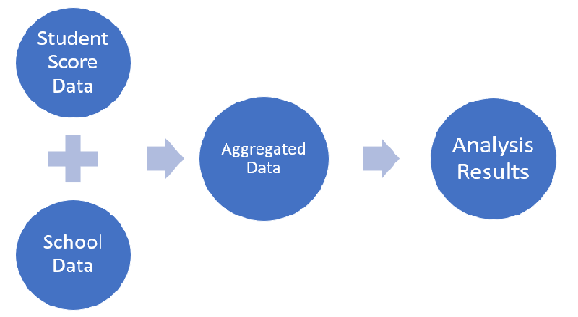
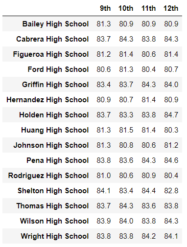

# School_District_Analysis

## Overview of Project

This project is the forth weekly challenge of the Data Science Bootcamp. It allows us to put into practice and showcare the skills learned in Module 4 of the bootcamp.

### Purpose

The City School Board has requested analysis on student funding and student standardized test math and reading scores across a number of schools. This analysis will help the School Superintendent and School Board in making decisions regarding future funding and priorities.

The requested information included:

- A high-level snapshot of the district's key metrics, presented in a table format
- An overview of the key metrics for each school, presented in a table format
- Tables presenting each of the following metrics:
  - Top 5 and bottom 5 performing schools, based on the overall passing rate
  - The average math score received by students in each grade level at each school
  - The average reading score received by students in each grade level at each school
  - School performance based on the budget per student
  - School performance based on the school size
  - School performance based on the type of school

Addtionally, the School Board has requested the removal of a number of scores from the final analysis.

## Results

Analysis of the input files was carried out in Python 3.7 using a Jupyter Notebook environment ([PyCitySchools_Challenge.ipynb Notebook](./PyCitySchools_Challenge.html)).

The student score data was cleaned and suspected scores marked as NaN (*Not A Number*) before aggregating to the the school data for the full analysis.



The input files **students_complete.csv** and **schools_complete.csv** were provided in CSV format and can be downloaded from the folder [Resources/](Resources/).

Note:  suspected scores included all math and reading scores for 9th Grade students in Thomas High School.

### Analysis

The scores for the 9th grade students in Thomas High School were removed from the dataset.  This meant that although the students would be taken into consideration for any budget-related metrics, their scores would not be included into the score performance metrics.  Here is the code used to remove the data and a sample of the final student data with the score data removed (converted into NaN).

[](Resources/Code%20-%20Replace%20scores%20with%20NaN.png)

[](Resources/Student_table_after_replacing_scores.png)

The School Board was concerned about the effects of removing the suspect data in the metrics calculated. Below we review the effects on the results as compared to the work done without removing data.

#### District Summary

At the District Summary level, we can see a decrease of 0.1 in the Average Math Score at the precision presented (1 decimal place).  Other metrics remain unchanged as it can be seen from the snapshots below.

Before removing suspect data:


After removing suspect data:


#### School Summary

The only school affected by the removal of the suspect data is Thomas High School. Comparing the metrics before and after removing the suspect data, we see that a small change in the Average Reading Score and passing percentages after the score values for the 9th grade students were removed.

| Metric | Value Before | Value After|
|:--- | ---: | ---:|
|School Type                    |Charter |  Charter |
|Total Students                 |   1635 |1635      |
|Total School Budget      |$1,043,130.00 | $1,043,130.00 |
|Per Student Budget       |     $638.00   | $638.00       |
|Average Math Score       |    83.4    |83.4    |
|Average Reading Score    |   83.8     |**83.9**    |
|% Passing Math           |   93.3     |**93.2**    |
|% Passing Reading        |   97.3     |**97.0**    |
|% Overall Passing        |   90.9     |**90.6**    |

#### Performace Between Schools

Although removing the suspect grades decreased the overall passing percentage of Thomas High School, the drop was not enough to move its performance relative to the other school in the district.  As it can be seen below, Thomas High School remains as the top second school by *% Overall Passing*

Before removing suspect data:


After removing suspect data:


#### Math and Reading Scores by Grade

When we look at the information by grade by school it's clear that only the average scores for 9th grade Thomas High School are affected.

Math and Reading scores before removing suspect data:

 

Math and Reading scores after removing suspect data:

 

#### Scores by school spending

Thomas High School falls within the $630-644 bin, so we expect to see a change after removing the suspect data.  It's there as shown below, but it's necessary to increase the precision to more decimal places.

For practical purposes, this metric is unaffected.


After removing suspect data:


#### Scores by school size

Thomas High School falls within the Medium (1000-2000) size bin. As in the previous case, there is a small change, but the again it's necessary to increase the precision to more decimal places.

The results at the requested precision are unaffected.


#### Scores by school type

Thomas High School is a Charter school. Removing the suspect scores shows no effect on the numbers at the precision requested by the Board.


## Summary

In this analysis, the handling of the score tests for the 9th grade students in Thomas High School required specific changes to the analysis script.

1. Replace the value for the math and reading scores for the targeted group with a NaN (Not a Number) construct so they wouldn't be taken into consideration when calculating averages.

2. The number of students used in score metrics to Thomas High School must be calculated separatedly to the other schools as it shouldn't include 9th graders.

```python
# Step 5.  Get the number of 10th-12th graders from Thomas High School (THS).
THS_10_12_count = school_data_complete_df[(school_data_complete_df["grade"]!="9th")
                & (school_data_complete_df["school_name"]=="Thomas High School")].count()["Student ID"]
```

3. Thomas High School metrics on passing percentages have to be calculated separatedly to the other schools using the number of students from the previous point. Here is an example of the calculation used for the *% Passing Math* metric.

```python
# Step 6. Get all the students passing math from THS
passing_math_THS_df = school_data_complete_df.loc[(school_data_complete_df["math_score"] >=70)
                & (school_data_complete_df["school_name"]=="Thomas High School")]
# Step 9. Calculate the percentage of 10th-12th grade students passing math from Thomas High School. 
passing_math_percentage_THS = passing_math_THS_df["Student ID"].count()/ float(THS_10_12_count) * 100
```

4. The Thomas High School metrics then had to be updated into the main data set so that analysis and reporting could continue. For example the code below replaces the value on the main dataframe with the THS metric for *% Passing Math*:

```python
# Step 12. Replace the passing math percent for Thomas High School in the per_school_summary_df.
per_school_summary_df.loc["Thomas High School", "% Passing Math"] = passing_math_percentage_THS